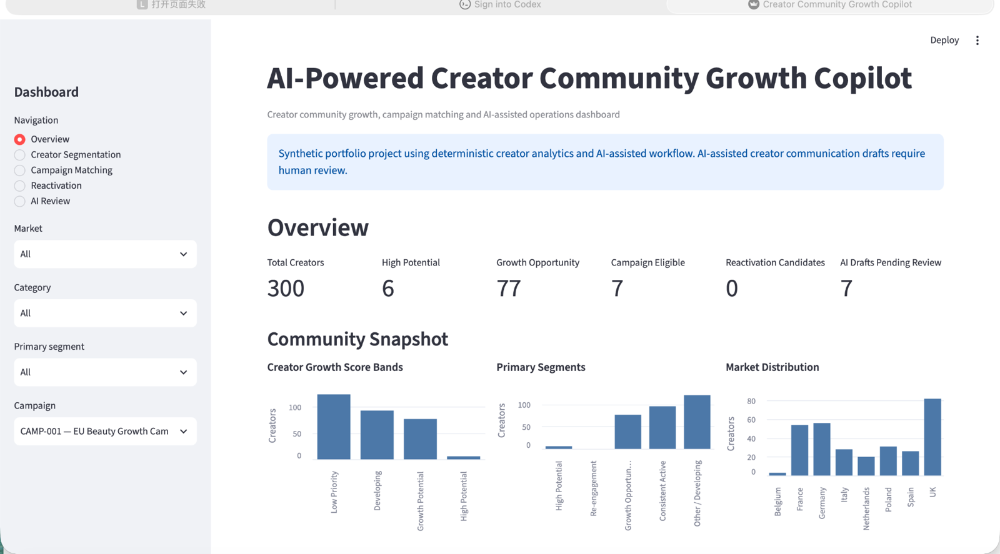
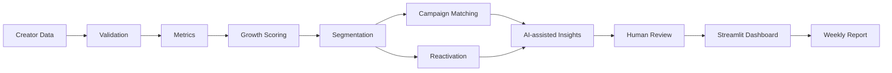
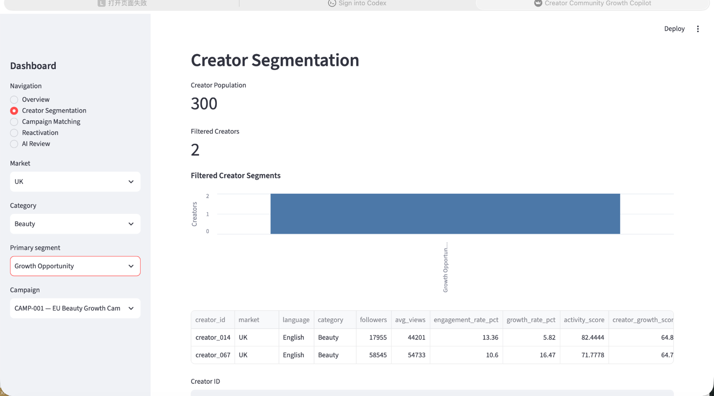
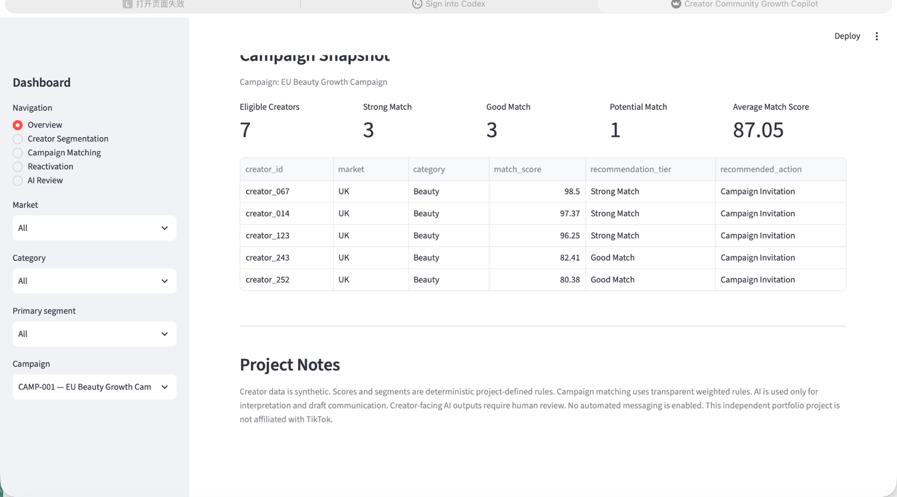
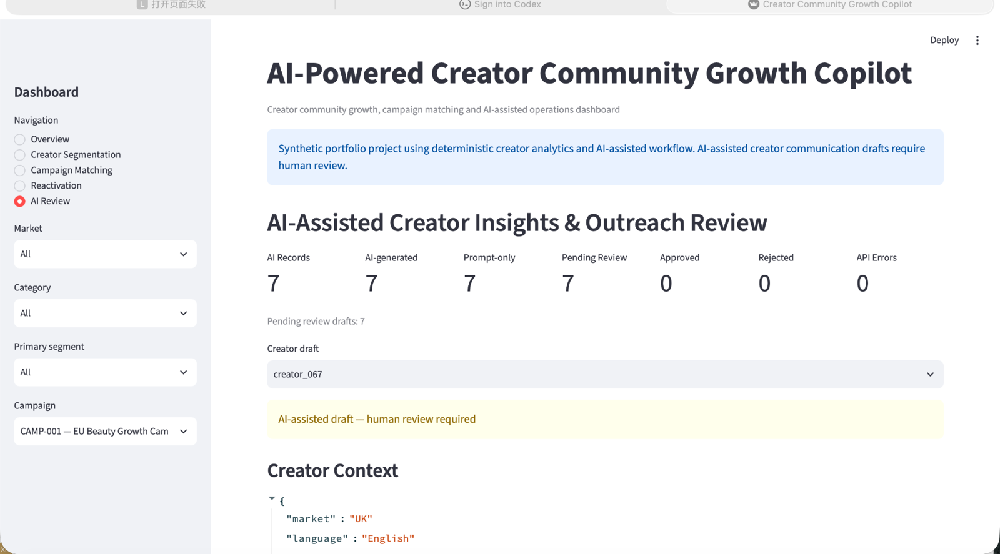
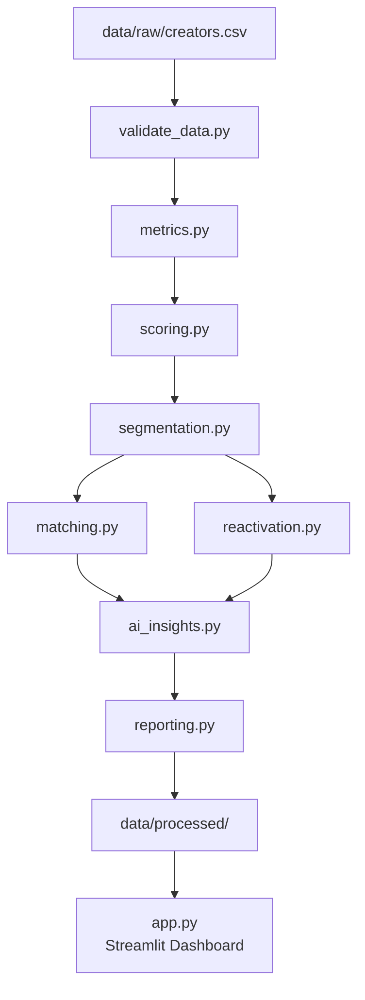

# Creator Community Growth Copilot

<p align="left">
  <strong>AI-assisted creator operations dashboard for community growth, creator segmentation, campaign matching, reactivation, and human-reviewed outreach.</strong>
</p>

<p><a href="https://creator-community-growth-copilot-nrvy7k4cawyjdffl5gazsw.streamlit.app">🚀 Live Demo</a> · <a href="https://github.com/pengxinyi2026/creator-community-growth-copilot">💻 GitHub</a></p>

<p><a href="https://creator-community-growth-copilot-nrvy7k4cawyjdffl5gazsw.streamlit.app">🚀 Live Demo</a> · <a href="https://github.com/pengxinyi2026/creator-community-growth-copilot">💻 GitHub</a></p>

<p>
  <a href="#run-locally">Run locally</a> ·
  <a href="#core-workflows">Core workflows</a> ·
  <a href="#technical-architecture">Architecture</a>
</p>

## Dashboard Preview



> An end-to-end creator operations prototype that turns creator-level performance data into prioritisation, campaign matching, reactivation, AI-assisted communication, and weekly reporting.

### Project snapshot

| Metric | Demo result |
| --- | ---: |
| Creator population | 300 |
| Growth Opportunity creators | 77 |
| Campaign-eligible creators | 7 |
| AI drafts pending review | 7 |

*The dataset shown above is synthetic and the figures are generated by the project's deterministic demo workflow.*

## The Problem

Creator teams often need to answer several operational questions at once:

- Which creators should receive attention?
- Which creators fit a particular campaign?
- Which creators show useful growth signals?
- Which creators may need reactivation?
- How can outreach be personalised while keeping a human in control?

This project brings those questions into a single repeatable workflow.

## From Creator Data to Action



The design separates deterministic business rules from AI-assisted interpretation and keeps creator-facing communication reviewable by a human.

## Core Workflows

### 1. Creator Segmentation

The dashboard lets an operator filter the creator population by market, category, and operational segment, then drill into creator-level metrics and rationale.



### 2. Campaign Matching

Campaign matching uses transparent project-defined weighted rules and surfaces match score, recommendation tier, recommended action, and supporting match signals.



### 3. Reactivation

The reactivation workflow identifies creators who meet the defined reactivation criteria and also handles the empty-state case when no creators qualify.

### 4. AI-assisted Review

AI is used for interpretation and draft communication support rather than autonomous outreach.



The review workflow exposes creator context, growth insight, personalisation points, generation status, and review status. Creator-facing drafts remain subject to human review.

## What I Built

I designed and implemented the end-to-end creator operations workflow, including:

- Creator metric calculation and deterministic growth scoring
- Operational creator segmentation
- Campaign matching using transparent weighted rules
- Creator reactivation workflow
- Streamlit dashboard for operational review
- AI-assisted insight and outreach draft workflow
- Human-review controls for creator-facing communication
- Reproducible one-command processing pipeline
- Git/GitHub project structure and portfolio documentation

## Technical Architecture



## AI with Human-in-the-Loop

```text
Creator Context
      ↓
Growth Insight
      ↓
Personalisation Points
      ↓
Draft Outreach
      ↓
Human Review
      ↓
Approved / Rejected
```

By default, the project can run in prompt-only mode. Optional OpenAI generation can be enabled separately.

Creator-facing communication is not automatically sent. The dashboard's review control is session-only and is designed for demonstration rather than real message approval or delivery.

## Tech Stack

**Language:** Python  
**Data:** Pandas, CSV, JSON  
**Dashboard:** Streamlit, Altair  
**AI:** Optional OpenAI API integration  
**Workflow:** Modular Python pipeline  
**Version control:** Git / GitHub

## Run Locally

Create and activate a virtual environment:

```bash
python -m venv .venv
source .venv/bin/activate
```

Install dependencies:

```bash
pip install -r requirements.txt
```

Run the end-to-end pipeline:

```bash
python run_pipeline.py
```

Start the dashboard:

```bash
streamlit run app.py
```

Open:

```text
http://localhost:8501
```

### Regenerate the synthetic demo dataset

```bash
python run_pipeline.py --generate-synthetic
```

### Optional AI generation

```bash
python run_pipeline.py --use-ai
```

### Limit AI processing

```bash
python run_pipeline.py --ai-limit 5
```

## Project Structure

```text
creator-community-growth-copilot/
├── app.py
├── run_pipeline.py
├── requirements.txt
├── README.md
├── .gitignore
├── .env.example
├── data/
│   ├── raw/
│   └── processed/
├── docs/
│   └── screenshots/
└── src/
    ├── generate_data.py
    ├── validate_data.py
    ├── metrics.py
    ├── scoring.py
    ├── segmentation.py
    ├── matching.py
    ├── reactivation.py
    ├── ai_insights.py
    └── reporting.py
```

## Scope & Limitations

- The creator dataset is synthetic and intended for portfolio demonstration.
- Scores, segments, and campaign matching are generated using transparent project-defined rules.
- AI-assisted outputs are drafts for human review.
- No automated creator messaging is enabled.
- This is an independent portfolio project and is not affiliated with TikTok or another platform.

## Why This Project Matters

Creator operations often sit between analytics and execution.

This project demonstrates how creator data can be translated into an operational workflow:

**data → prioritisation → segmentation → campaign action → reactivation → AI-assisted communication → human review**

The emphasis is on building a repeatable decision-support workflow that connects analytics with practical creator operations.
